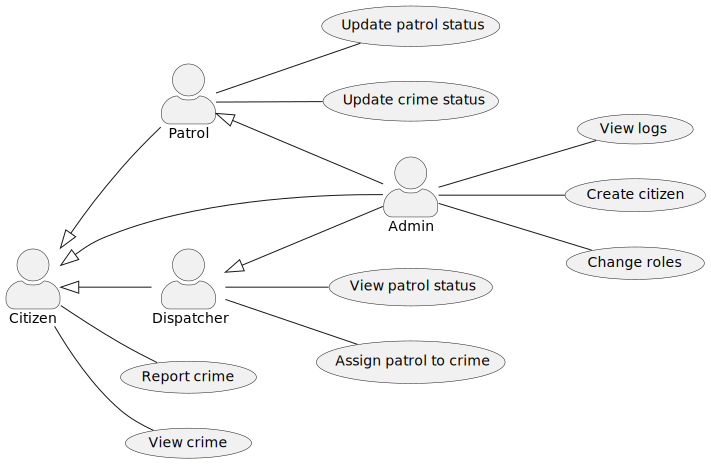

# Introduction and Overview 

The crime surveillance system provides functionality that keeps the city safe.

In the system, users can report and view crimes, police patrols can register, view, and update crimes, and police dispatchers can view patrol status and dispatch police patrols to crime reports. 

## Requirements

Design the backend such that:
- a large user base can report crime information and reports will persist
- patrol state should be updated fast and in real-time for timely surveillance network purposes
- user authentication is required for core functionality on crime status reporting and patrol dispatch
- each network activity should be logged for compliance and security reasons.

# System Architecture

The backend service is designed such that it is composed of multiple microservices as shown below.


CaddyService will route HTTPS/REST requests to BrokerService and microservices will mostly communicate with each other using gRPC. 

Patrol service will update location with Redis in real-time and update PostgreSQL patrol information with lower frequency. 

## Rationale

Microservices architecture increases independent deployability, scalability, and isolation of failures.

The usage of PostgreSQL is used for persistence of authentication data for better account and role management. 

The usage of MongoDB is used for flexible storage of future log information.

The usage of Redis is used for performance-critical patrol systems, where patrol state has a relatively limited user base but high-frequency updates and potential real-time streaming applications.

The communication between microservices uses gRPC for more robustness, lower latency, and smaller payloads than JSON/HTTP between microservices.

# Data Design


# User Interface Design



# API 

## API Reference

See full OpenAPI spec: [openapi.yaml](./api/openapi.yaml)

### Crime Management Endpoints
| Method | Path               | Description                          | Auth Required |
|--------|--------------------|--------------------------------------|---------------|
| GET    | `/crimes`          | List all crime reports               | No            |
| POST   | `/crimes`          | Submit a new crime report            | No            |
| PUT    | `/crimes/{id}`     | Update crime status or assign patrol | Yes           |
| DELETE | `/crimes/{id}`     | Delete a crime by ID                 | Yes           |

### Patrol Management Endpoints
| Method | Path               | Description                          | Auth Required |
|--------|--------------------|--------------------------------------|---------------|
| GET    | `/patrols`         | List all patrols and their status   | Yes           |
| POST   | `/patrols`         | Register a new police patrol         | Yes           |
| GET    | `/patrols/{id}`    | Get specific patrol information      | Yes           |
| PUT    | `/patrols/{id}`    | Update patrol status and location    | Yes           |

### Dispatch Endpoints
| Method | Path               | Description                          | Auth Required |
|--------|--------------------|--------------------------------------|---------------|
| POST   | `/dispatch`        | Assign patrol to an existing crime   | Yes           |

### Authentication Endpoints
| Method | Path               | Description                          | Auth Required |
|--------|--------------------|--------------------------------------|---------------|
| PATCH   | `/admin/users/{id}/role` | Admin sign in for system access| Yes           |
| POST    | `/users`                 | Register new user (as CITIZEN) | No           |
---

## Data Models

### Crime Status Values
- `new`: Initial crime report
- `assigned`: Patrol has been assigned
- `resolved`: Crime has been resolved

### Patrol Status Values
- `available`: Patrol is available for assignment
- `busy`: Patrol is currently responding to a call

### Location Object
```json
{
  "street": "string",
  "city": "string", 
  "state": "string",
  "latitude": "number",
  "longitude": "number"
}
```

---

## Authentication

The API uses JWT Bearer token authentication for protected endpoints. Include the token in the Authorization header:

```
Authorization: Bearer <your-jwt-token>
```

## Error Responses

- `401 Unauthorized`: Invalid or missing credentials
- `404 Not Found`: Resource not found

# Assumptions

- Users are trusted not to abuse the API (No RateLimit implemented in V1)
- Assume there is no duplicated crime report for each actual incidence
- Users are assumed to report valid crimes
- PostgreSQL, Redis, MongoDB are deployed internally (V1)
- Only patrols can update crime state
- Street, City, State are assumed to be obtained from external server with latitude and longitude
- Patrols are assumed to keep pushing location updates in real-time
